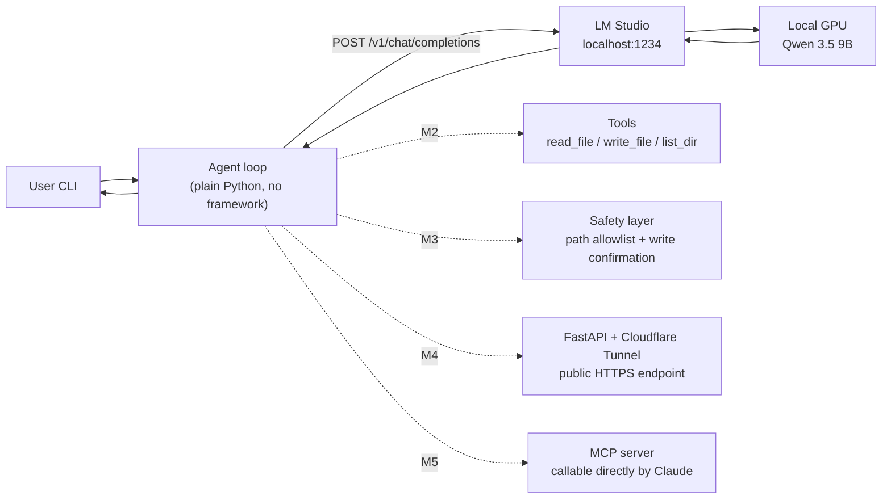

# local-llm-agent

> A from-scratch coding agent that runs entirely on my own GPU — local LLM, hand-written tool-calling loop, exposed as an OpenAI-compatible API.

Building a tool-using coding agent from scratch, on my own machine. No cloud LLM calls; all inference stays on a local GPU.

**Status: M1 complete (multi-turn conversation)** · In active development, updated daily

---

## Why build this

Most "AI agent" projects wrap a cloud API in yet another framework. This one goes the other way: the model runs on my own GPU, the tool-calling loop is hand-written, and the public service is packaged myself. The point is to build every link in the chain once by hand, rather than only knowing how to call a framework.

---

## Architecture



Solid lines are done; dashed lines are planned.

---

## Roadmap

| Milestone | Scope | Status |
|---|---|---|
| **M1** | Run a local model in LM Studio, talk to its OpenAI-compatible endpoint, build a multi-turn chatbot | ✅ Done |
| **M2** | Tool schemas + `read_file` / `write_file` / `list_dir` + the tool-calling loop | ⬜ |
| **M3** | Agent loop with an iteration cap + execution safety (path allowlist, confirmation before writes) | ⬜ |
| **M4** | Wrap as an OpenAI-compatible API with FastAPI, add bearer-token auth, expose it via Cloudflare Tunnel | ⬜ |
| **M5** | Package as an MCP server so Claude can call it directly | ⬜ |

---

## Demo

<!-- TODO(M4): 30-second GIF — calling the self-hosted public endpoint from a phone and getting a response from the local GPU -->
_Coming once M4 lands._

---

## Requirements

- Python 3.10+ (developed on 3.14; **standard library only, no third-party dependencies**)
- [LM Studio](https://lmstudio.ai/), with a model loaded and **Start Server** pressed on the Developer tab
- A GPU large enough for the model (when downloading, pick a quantization tagged `Full GPU Offload Possible`)

## Running it

1. LM Studio → Developer → load a model → **Start Server** (defaults to `http://localhost:1234`)
2. Confirm the server is up and note the model id it reports:

   ```bash
   python api_test_list_models.py
   ```

3. Put that model id into the `MODEL` constant at the top of each script
4. Start a multi-turn conversation:

   ```bash
   python multi_turn_dialogue.py
   ```

   Type `exit` or `quit` to stop. The conversation is written to `multi_turn_dialogue.json` and reloaded on the next run.

## Files

| File | Purpose |
|---|---|
| `api_test_list_models.py` | Confirm the LM Studio server is alive; list available model ids |
| `api_test_chat_completions.py` | The smallest possible single API call |
| `single_turn_dialogue.py` | Single-turn conversation, split into build_body / send / reply |
| `history_dialogue.py` | Side-by-side experiment: the same two questions with and without conversation history |
| `multi_turn_dialogue.py` | **The M1 program** — multi-turn conversation, persisted to JSON and reloaded across runs |

---

## Design decisions

<!-- This is the section interviewers actually read. Add an entry for each decision: what was chosen, why, and what was given up. -->

- **LM Studio over Ollama.** Its GUI shows directly whether VRAM is sufficient and whether the model fully offloaded to the GPU, which removes most of the early troubleshooting. Both expose an OpenAI-compatible endpoint, so the switching cost later is near zero — the only real difference is the port (LM Studio `1234`, Ollama `11434`).
- **Qwen-family model.** Native tool-use support, so M2's tool-calling work will not be spent fighting output formats.
- **Plain `urllib` from the standard library instead of the `openai` SDK.** The goal is to see exactly what JSON goes out and what the `tool_calls` response actually looks like. An SDK would hide that layer.
- **The system prompt is not stored in the history file.** `build_body()` prepends it on every request, so changing the system prompt does not require clearing the saved history.
- **History is saved in a `finally` block.** A normal exit, Ctrl+C, or an unexpected exception all still persist the conversation.

<!-- TODO(M2): why a tool's description should read like documentation, not like a code comment -->
<!-- TODO(M3): why os.path.realpath() prefix comparison beats string-checking for "../" -->
<!-- TODO(M4): why Cloudflare Tunnel over ngrok or opening a port directly -->

---

## Development log

<!-- TODO(M5): link here once MkDocs Material + GitHub Pages is live -->
_In progress._
