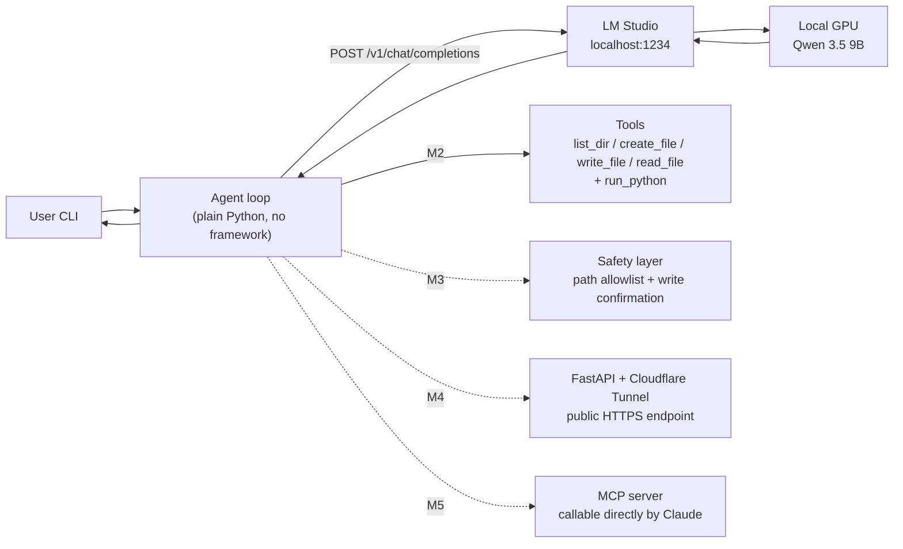

# local-llm-agent

> A from-scratch coding agent that runs entirely on my own GPU — local LLM, hand-written tool-calling loop, exposed as an OpenAI-compatible API.

Building a tool-using coding agent from scratch, on my own machine. No cloud LLM calls; all inference stays on a local GPU.

**Status: M2 complete (the model writes a program and runs it)** · In active development, updated daily

---

## Why build this

Most "AI agent" projects wrap a cloud API in yet another framework. This one goes the other way: the model runs on my own GPU, the tool-calling loop is hand-written, and the public service is packaged myself. The point is to build every link in the chain once by hand, rather than only knowing how to call a framework.

---

## Architecture



Solid lines are done; dashed lines are planned.

---

## Roadmap

| Milestone | Scope | Status |
|---|---|---|
| **M1** | Run a local model in LM Studio, talk to its OpenAI-compatible endpoint, build a multi-turn chatbot | ✅ Done |
| **M2** | Tool schemas + `list_dir` / `create_file` / `write_file` / `read_file` / `run_python`, and the agent loop with an iteration cap | ✅ Done |
| **M3** | Execution safety: path allowlist, confirmation before writes | ⬜ |
| **M4** | Wrap as an OpenAI-compatible API with FastAPI, add bearer-token auth, expose it via Cloudflare Tunnel | ⬜ |
| **M5** | Package as an MCP server so Claude can call it directly | ⬜ |

---

## Demo

<!-- TODO(M4): 30-second GIF — calling the self-hosted public endpoint from a phone and getting a response from the local GPU -->
_Coming once M4 lands._

---

## Requirements

- Python 3.10+ (developed on 3.14; **standard library only, no third-party dependencies**)
- [LM Studio](https://lmstudio.ai/), with a model loaded and **Start Server** pressed on the Developer tab
- A GPU large enough for the model (when downloading, pick a quantization tagged `Full GPU Offload Possible`)

## Running it

1. LM Studio → Developer → load a model → **Start Server** (defaults to `http://localhost:1234`)
2. Confirm the server is up and note the model id it reports:

   ```bash
   python M1/api_test_list_models.py
   ```

3. Put that model id into the `MODEL` constant at the top of each script
4. Start a multi-turn conversation:

   ```bash
   python M1/multi_turn_dialogue.py
   ```

   Type `exit` or `quit` to stop. The conversation is written to `multi_turn_dialogue.json` and reloaded on the next run.

5. Watch the model plan a four-step file task and call the tools itself:

   ```bash
   python M2/create_read_write_list_tool_schemas.py
   ```

   Files are created under `M2/sandbox/`, which is not version-controlled. Run it twice: the second run finds `test.log` already there and takes the other branch of the same request.

6. Watch it write a program and then execute it:

   ```bash
   python M2/coding_and_execute.py
   ```

   The model creates `fizzbuzz.py`, writes the code into it, runs it with `run_python`, and reports what the program actually printed — four rounds, no step scripted in advance.

## Files

| File | Purpose |
|---|---|
| `M1/api_test_list_models.py` | Confirm the LM Studio server is alive; list available model ids |
| `M1/api_test_chat_completions.py` | The smallest possible single API call |
| `M1/single_turn_dialogue.py` | Single-turn conversation, split into build_body / send / reply |
| `M1/history_dialogue.py` | Side-by-side experiment: the same two questions with and without conversation history |
| `M1/multi_turn_dialogue.py` | **The M1 program** — multi-turn conversation, persisted to JSON and reloaded across runs |
| `M2/no_tools.py` | Baseline: the same question asked with no tools at all |
| `M2/has_tools.py` | A hand-rolled `TOOL_CALL:` convention, parsed back out with a regex |
| `M2/has_tool_schemas.py` | The API's own tool-calling protocol, run against four schema variants to see whether the name or the description carries the decision |
| `M2/create_read_write_list_tool_schemas.py` | Four file tools with strict preconditions; the model plans a four-step task and calls them in order |
| `M2/coding_and_execute.py` | **The M2 program** — adds `run_python`, a subprocess-backed execution tool; the model writes a Python file, runs it, and answers from the real output |

---

## Design decisions

<!-- This is the section interviewers actually read. Add an entry for each decision: what was chosen, why, and what was given up. -->

- **LM Studio over Ollama.** Its GUI shows directly whether VRAM is sufficient and whether the model fully offloaded to the GPU, which removes most of the early troubleshooting. Both expose an OpenAI-compatible endpoint, so the switching cost later is near zero — the only real difference is the port (LM Studio `1234`, Ollama `11434`).
- **Qwen-family model.** Native tool-use support, so M2's tool-calling work will not be spent fighting output formats.
- **Plain `urllib` from the standard library instead of the `openai` SDK.** The goal is to see exactly what JSON goes out and what the `tool_calls` response actually looks like. An SDK would hide that layer.
- **The system prompt is not stored in the history file.** `build_body()` prepends it on every request, so changing the system prompt does not require clearing the saved history.
- **History is saved in a `finally` block.** A normal exit, Ctrl+C, or an unexpected exception all still persist the conversation.
- **A tool description is documentation, not a code comment — where the ordering is decided.** The model never sees the function body, so the description is the whole interface. The four file tools spell out their preconditions: "It never creates: writing to a file that does not exist fails, so call `create_file` first." That clause is what makes the model call `create_file` unprompted. `run_python` gets a single line instead, and deliberately so — by the time the model reaches it, the order has already been settled upstream by `write_file`'s description, and restating it would only be noise. Preconditions belong in the tool where the decision is actually made, not in every tool downstream of it.
- **`subprocess` rather than `exec()` for running the model's code.** A separate process is what makes the three things an agent needs available at all: a real exit code, stdout and stderr kept apart, and a timeout that can kill a runaway loop. `exec()` would run generated code inside the agent's own namespace, where a single `sys.exit()` in that code takes the agent down with it. The price is one interpreter startup per run — tens of milliseconds against a multi-second model call, so it never shows.
- **`run_python(path)` rather than `run_python_code(source)`.** Handing source straight to the runner would collapse three tool calls into one and make `create_file` and `write_file` redundant. Taking a path keeps the dependency chain real: a file must exist before it can be written to, and must hold code before it can be run. The call order is then forced by the tools' own preconditions instead of being requested in the system prompt — which is the thing M2 exists to demonstrate.

<!-- TODO(M3): why os.path.realpath() prefix comparison beats string-checking for "../" -->
<!-- TODO(M4): why Cloudflare Tunnel over ngrok or opening a port directly -->

---

## Development log

<!-- TODO(M5): link here once MkDocs Material + GitHub Pages is live -->
_In progress._

---

## Acknowledgements

- Dr. Feis Ken-Yi Lee — [feis.studio](https://feis.studio/) — course: 駕馭程式代理人：從原理到掌控自動化開發 (*Mastering Coding Agents: From Principles to Controlling Automated Development*)
